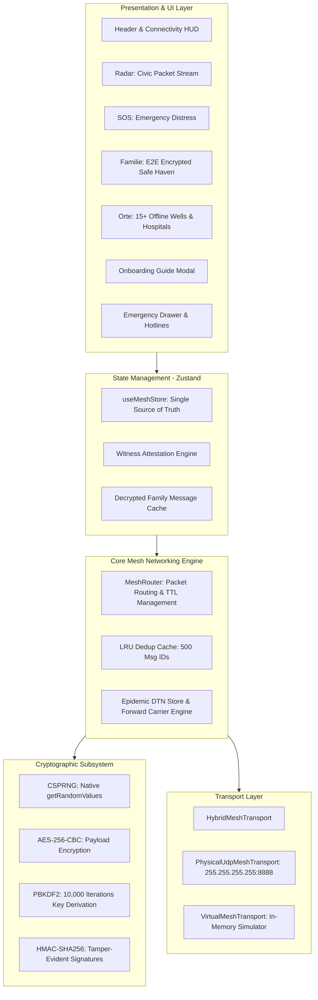
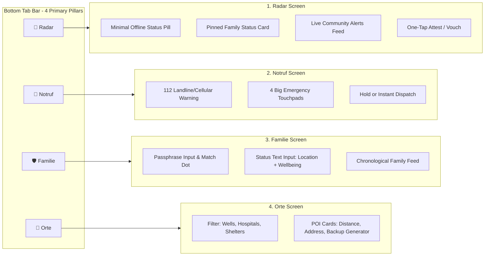

# Emergency Mesh Nürnberg — Systems Architecture & Calm UI Redesign

A comprehensive specification of the application's underlying architecture, networking stack, cryptographic engine, state management, and an exhaustive UX audit and redesign system replacing the complex tactical cockpit with a calm, high-trust civilian interface.

---

## 1. Executive Summary & Product Vision

### 1.1 The Blackout Scenario (Situation A)
- **Context:** Complete catastrophic failure of primary civil infrastructure across the Nuremberg metropolitan area (severe Pegnitz flood, grid collapse, sabotage, or cellular ISP blackout).
- **Core Mission:** Enable civilian-to-civilian peer discovery, emergency distress broadcasting (SOS), tamper-resistant family check-ins (Lebenszeichen), and offline access to critical municipal survival points (unpowered manual water wells, trauma centers, emergency shelters).
- **Zero-Dependency Constraint:** Operates with **0% cellular signal, 0% internet access, 0 external servers, and no SIM card required**.

---

## 2. Full Systems Architecture

### 2.1 Networking & Transport Layer
1. **Physical UDP Radio (`PhysicalUdpMeshTransport`):**
   - Binds to local port `8888` on all interfaces (`0.0.0.0`).
   - Broadcasts datagrams across the local subnet via `255.255.255.255:8888`.
   - Leverages standard mobile Wi-Fi Hotspots or ad-hoc Wi-Fi without internet connectivity.
2. **Virtual Network Bus (`VirtualMeshTransport`):**
   - In-memory event bus linking simulated nodes (`peer-altstadt-01`, `peer-gostenhof-02`) with simulated RF propagation and latency for emulator testing.
3. **Hybrid Transport (`HybridMeshTransport`):**
   - Automatically detects whether the native Android UDP radio is active.
   - Merges peer lists across physical radios and virtual buses seamlessly.
4. **Epidemic Delay-Tolerant Networking (DTN):**
   - For disconnected mesh partitions across Nürnberg, mobile nodes act as "data mules."
   - Retains packets in a store-and-forward buffer until a new peer connection handshake triggers an epidemic sync exchange.

### 2.2 Cryptographic Security Model
- **Public Packets (SOS & HAZARD):** Unencrypted plaintext broadcast with GPS coordinates for immediate civilian/rescuer visibility. Signed with an HMAC signature for anti-spoofing attestation.
- **Private Packets (SAFE):**
  - Symmetric Encryption: `AES-256-CBC` with random 16-byte IV.
  - Key Derivation: `PBKDF2` (10,000 iterations, SHA-256) from user-selected shared family passphrase.
  - Anonymity: Packets routed blindly by intermediate nodes. Only nodes possessing the shared secret can derive the decryption key.
- **Randomness:** Hardware-backed CSPRNG via `react-native-get-random-values` polyfill mapped directly to `globalThis.crypto.getRandomValues()`.

---

## 3. UX Critique: Why the Previous UI Failed

### 3.1 The "Cognitive Verification Tax" in Crises
During acute life-safety emergencies, human working memory shrinks. Users suffer from tunnel vision, fine-motor degradation, and heightened adrenaline. 

The previous interface suffered from **Complexity Displacement**:
1. **Intimidating Military/Tactical Overload:**
   - Dark OLED black combined with neon-reds (`#d90429`), hazard yellows (`#ffb703`), and tactical jargon (`KATS-DEFCON 1`, `KATS-MED-01`) induced anxiety rather than reassurance.
   - Looked like a pilot's cockpit or a hacker terminal instead of an accessible civil defense utility.
2. **Leaking Protocol Telemetry to Civilians:**
   - Elements like `TTL: 10`, `Hop Count`, `PEGNITZ-8888 · 2.4 GHz`, `PBKDF2 (10.000)`, and `AES-256-CBC` were exposed on main screens. Civilians do not care about packet routing budgets; they need to know: *"Did my family get the message?"* and *"Where is drinking water?"*
3. **High Visual Vibration & Low Readability:**
   - Extreme contrast (pure `#000000` against harsh saturated neons) caused eye fatigue in low-light/candlelight conditions.
   - Fragmented layout with tiny badge chips scattered across cards created visual noise and high cognitive friction.

---

## 4. The New Design System: "Calm Civic Defense"

Inspired by Scandinavian and Swiss public crisis services, modern emergency dispatches (BOS/NINA), and Apple Emergency SOS. It prioritizes **clarity, emotional stability, and high contrast without harsh glare**.

### 4.1 Color Architecture

| Semantic Role | Token | Hex Code | Purpose |
|---|---|---|---|
| **Canvas Background** | `bgPrimary` | `#0D1117` | Deep calming slate (not pure black); reduces contrast glare. |
| **Card Surface** | `surfaceCard` | `#161E2E` | Soft dark navy card background with clear boundaries. |
| **Surface Border** | `borderSubtle` | `#233044` | Structural boundary lines (1px) for card grouping. |
| **Primary Text** | `textPrimary` | `#F8FAFC` | Crisp off-white; maximum legibility. |
| **Secondary Text** | `textSecondary` | `#94A3B8` | Cool slate; descriptive secondary details. |
| **Life Safety / SOS** | `accentRed` | `#EF4444` | Warm emergency red (distress, urgent action). |
| **Safe Haven / Family** | `accentGreen` | `#10B981` | Calming emerald green (safe check-ins, active link). |
| **Warning / Caution** | `accentAmber` | `#F59E0B` | Reassuring warm amber (unconfirmed reports, hazards). |
| **Civic Water / Aid** | `accentBlue` | `#38BDF8` | Fresh civic blue (water wells, medical facilities). |

### 4.2 Typography Hierarchy
- **Primary Font Family:** System Sans-Serif (SF Pro on iOS, Roboto on Android) with high x-height for readability under vibration or stress.
- **Numbers / Distance:** Monospaced tabular numerals (`Platform.select({ ios: 'Menlo', android: 'monospace' })`) to prevent layout shifts during live range updates.
- **Scale:**
  - **HUD Title:** `20px` · Semi-Bold · Tight tracking.
  - **Card Headers:** `17px` · Bold · Clear separation.
  - **Body / Messages:** `15px` · Regular · High contrast.
  - **Badges / Captions:** `12px` · Medium · Uppercase with `0.5px` tracking.

### 4.3 Layout & Spacing Rules
- **Minimum Tap Target:** `48 x 48 dp` for all interactive elements (SOS buttons, tabs, toggles) to accommodate shaky fingers.
- **Card Padding:** Unified `16 dp` internal padding.
- **Card Gap:** Consistent `12 dp` vertical margin between list elements.
- **Elevation / Border:** 1px subtle borders (`#233044`) without heavy drop shadows to conserve GPU rendering cycles and battery power.

---

## 5. Redesigned Screen Architecture

### 5.1 Tab 1: Radar (Civic Message Stream)
- **Top Status Bar:**
  - Clean pill: `● Notnetz aktiv · 3 Geräte in Reichweite` (No RF frequencies, no technical mode names).
- **Pinned Family Alert (If Present):**
  - Prominent emerald-bordered card at the top displaying verified check-ins from loved ones.
- **Community Message Card:**
  - Clear emergency tag (`[MEDIZIN]`, `[FEUER]`, `[GEFAHR]`).
  - Humanized delivery path: `Direkt empfangen` or `Über 2 Nachbarn weitergeleitet` (replaces `TTL` and `Hops`).
  - Real-world distance and timestamp: `Vor 4 Min. · ca. 600m entfernt (Altstadt)`.
  - Attestation button: `✓ Bestätigen (2 Zeugen)`.

### 5.2 Tab 2: Notruf (SOS Emergency Beacon)
- **Prominent Priority Banner:**
  - *"Wenn Netz vorhanden ist, wählen Sie zuerst 112 oder 110."*
- **Four Large Emergency Action Cards (Zero Overlap, Minimum 72dp Height):**
  1. **Medizinischer Notfall** (Herz, Unfall, Bewusstlosigkeit) — Warm Red.
  2. **Feuer & Rauch** (Gebäudebrand, Gasgeruch) — Warm Amber/Orange.
  3. **Verschüttet / Eingeklemmt** (Einsturz, Trümmer) — Gold.
  4. **Wasser & Notversorgung** (Trinkwasserausfall, Säuglingsnahrung) — Soft Cyan.
- **Interaction:** Single tap broadcasts emergency GPS coordinates and alerts all nearby devices within milliseconds.

### 5.3 Tab 3: Familie (Private Safe Haven)
- **Clear Two-Step Workflow:**
  - **Schritt 1: Familien-Codewort:** Single input field with matching status dot.
  - **Schritt 2: Lebenszeichen senden:** Name input + status field (*"Bin sicher am Hauptmarkt. Trinkwasser geholt."*).
- **Eliminated Jargon:** Removed all instances of `PBKDF2`, `AES-256-CBC`, and `HMAC-SHA256`.
- **Replaced With:** A calm, reassuring badge: `🔒 Ende-zu-Ende geschützt · Nur Ihre Familie kann diese Nachrichten entschlüsseln`.

### 5.4 Tab 4: Orte (Offline Survival Directory)
- **Filter Tabs:** `Alle`, `Trinkwasser-Brunnen`, `Kliniken`, `Notunterkünfte`.
- **POI Card Layout:**
  - Name of facility (e.g. *Notwasserbrunnen Hauptmarkt*, *Klinikum Nürnberg Nord*).
  - Distance sorted automatically using offline GPS calculation (`ca. 450 m entfernt`).
  - Offline capability indicator: `Handpumpe (funktioniert ohne Strom)` or `Notstrom-Diesel aktiv`.
  - Walking direction and coordinates for navigation without Google Maps.

---

## 6. Implementation Blueprint & File Mapping

| File | Subsystem | Planned Implementation |
|---|---|---|
| `src/ui/responsive.ts` | Design Tokens | Replace `OLED_PALETTE` with `CALM_CIVIC_PALETTE` (slate backgrounds, soft emergency accents). |
| `src/App.tsx` | Main HUD & Views | Implement the 4 calm tabs; drop technical debug overlays into the auxiliary menu drawer. |
| `src/i18n/translations.ts` | Language System | Refactor all string keys to non-technical, empathetic civilian vocabulary (DE & EN). |
| `src/components/TacticalDrawer.tsx` | Telemetry Drawer | Relocate low-level diagnostics (UDP logs, node IDs, buffer counts) here for maintenance operators. |
| `src/components/EmergencyGuideModal.tsx` | Onboarding Carousel | Update visuals to match the calm aesthetic with illustrated crisis steps. |
